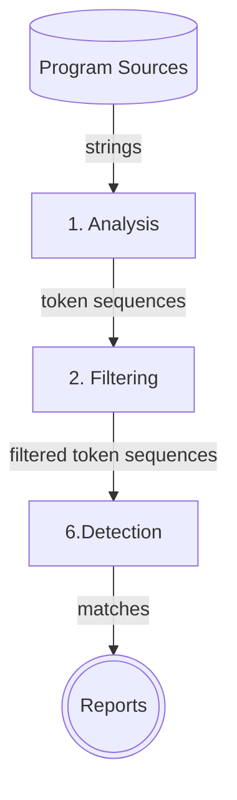
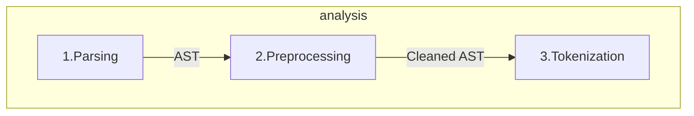
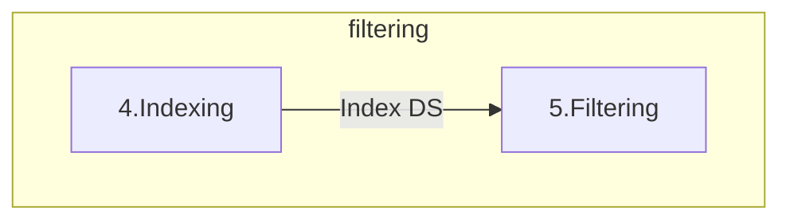

+++
title = "Code Plagiarism Detector Presentation"
description = "TODO"
outputs = ["Reveal"]
+++

<section data-noprocess>
    <h4>Alma Mater Studiorum $\cdot$ Università di Bologna</h4>
    <h6 style="font-size:0.8em;">Campus di Cesena</h6>
    <hr/>
    <p style="font-size:0.8em;">Dipartimento di informatica $-$ Scienza e Ingegneria</p>
    <p style="font-size:0.8em;">Corso di Laurea in Ingegneria e Scienze Informatiche</p>
    <h2 style="margin:1em 0"><a href="https://github.com/tassiLuca/bachelor-thesis/releases/latest">Progettazione e sviluppo di uno strumento per la scansione di progetti software alla ricerca di potenziali segni di plagio</a></h2>
    <p style="font-size:0.8em; margin-bottom:0">Elaborato in</p>
    <h6>PROGRAMMAZIONE A OGGETTI</h6>
    <div style="margin-top:1em;">
        <div style="width:50%; border-box:none; float: left">
            <p style="font-size:0.7em">Relatore</p>
            <p style="font-size:0.8em">Prof. Danilo Pianini</p>
        </div>
        <div style="width:50%; border-box:none; float: right">
            <p style="font-size:0.7em;">Presentata da:</p>
            <p style="font-size:0.8em;">Luca Tassinari</p>
        </div>
    </div>
</section>

---

## Plagiarismo e antiplagiarismo nel software

- problema annoso e in continua crescita
- ha visto, nel corso degli anni, numerosi scontri legali, i.e. Oracle vs. Google per Android 
- farlo manualmente è impraticabile $\Rightarrow$ è necessario un tool _automatico_
- sono pochi i progetti _open source_ di facile utilizzo

**MA**

Creare un software antiplagio è _complesso_!

---

### Sistemi antiplagio automatici e loro caratteristiche



---

## Requisiti di un tool antiplagio moderno

<div class="container">
<div class="col" style="width: 50%;">

- sia in grado di essere insensibile a rifattorizzazioni operate per offuscare la copiature

{}
- effettui il confronto su più progetti
  - ⚠️ la misura della similarità tra sorgenti è un'operazione onerosa in termini computazionali!
{}

</div>

<div class="col" style="width: 50%; font-size: 0.8em; vertical-align: center">



{}
**Tassonomia dei livelli di plagio di Faidhi & Robinson (1987)**

</div>
</div>

---

<div class="container">
<div class="col" style="width: 50%; text-align: right">

### Stadi logici di un tool antiplagio

</div>
<div class="col" style="width: 50%; padding: 0 22%">



</div>
</div>

---

### Fase 1: Analisi

**Scopo:** trasformare i sorgenti in rappresentazioni confrontabili che astraggano dai dettagli del linguaggio



1. I file sono _parsati_ $\rightarrow$ è generato l'_Abstract Syntax Tree_
2. _Preprocessing_: l'AST viene "ripulito" da dettagli insignificanti a livello semantico (commenti, dichiarazioni di `import`, `package`, ...)
3. L'AST viene visitato e vengono "emessi" i _token_ corrispondenti ai costrutti del linguaggio da valorizzare

---

<div class="container">
<div class="col" style="margin-left: -7%">

### Prima dell'analisi

```java
package org.examples;

import java.util.Arrays;

/**
 * This is a sample class to demonstrate the tokenization process.
 */
public class Main {
    public static void main(String[] args) {
        if (args.length > 0) {
            System.out.println("Program arguments: " + Arrays.toString(args));
        } else {
            System.out.println("Hello world from Java!");
        }
    }
}
```

</div>
<div class="col">

{}

### Dopo la _tokenizzazione_

```text
[class-interface-decl (line=8, column=1), 
method-decl (line=9, column=5), 
parameter (line=9, column=29), 
block-stmt (line=9, column=44), 
if-stmt (line=10, column=9), 
binary-expr (line=10, column=13), 
field-access-expr (line=10, column=13), 
name-expr (line=10, column=13), 
literal-expr (line=10, column=27), 
block-stmt (line=10, column=30), 
expression-stmt (line=11, column=13), 
method-call-expr (line=11, column=13), 
field-access-expr (line=11, column=13), 
name-expr (line=11, column=13), 
binary-expr (line=11, column=32), 
literal-expr (line=11, column=32), 
method-call-expr (line=11, column=56), 
name-expr (line=11, column=56), 
name-expr (line=11, column=72), 
block-stmt (line=12, column=16), 
expression-stmt (line=13, column=13),
method-call-expr (line=13, column=13), 
field-access-expr (line=13, column=13), 
name-expr (line=13, column=13), 
literal-expr (line=13, column=32)]
```

{}

</div>
</div>

---

### Fase 2: Filtraggio

**Scopo:** limitare il numero di confronti $\Rightarrow$ migliorare le prestazioni

<div style="padding: 0 20%">



</div>

4. Le rappresentazioni sono aggregate sotto forma di una struttura dati dalla quale è possibile estrarre informazioni statistiche sulla base delle quali viene stimata la similarità

{}

### Fase 3: Detection
Vengono applicati algoritmi di _matching_ sulle coppie di rappresentazioni non scartate dalla fase precedente.

{}

---

## Il tool sviluppato...

- permette di reperire i progetti da _repository_ su _GitHub_/_Bitbucket_
- 

---

## Configurabilità

---

## Validazione
