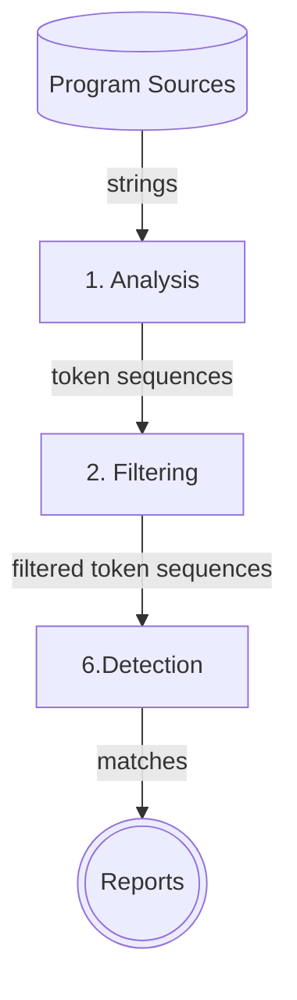
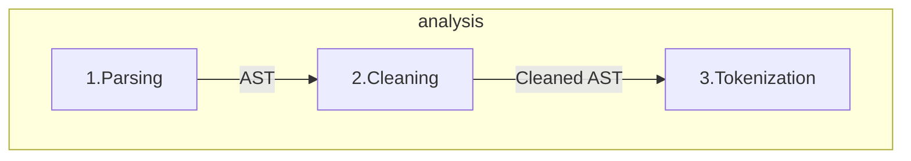

+++
title = "Code Plagiarism Detector Presentation"
description = "TODO"
outputs = ["Reveal"]
+++

<section data-noprocess>
    <h4>Alma Mater Studiorum $\cdot$ Università di Bologna</h4>
    <h6 style="font-size:0.8em;">Campus di Cesena</h6>
    

    
Dipartimento di informatica $-$ Scienza e Ingegneria

    
Corso di Laurea in Ingegneria e Scienze Informatiche

    <h2 style="margin:1em 0"><a href="https://github.com/tassiLuca/bachelor-thesis/releases/latest">Progettazione e sviluppo di uno strumento per la scansione di progetti software alla ricerca di potenziali segni di plagio</a></h2>
    
Elaborato in

    <h6>PROGRAMMAZIONE A OGGETTI</h6>
    

        

            
Relatore

            
Prof. Danilo Pianini

        

        

            
Presentata da:

            
Luca Tassinari

        

    

</section>

---

## Plagiarismo e antiplagiarismo nel software

- problema annoso e in continua crescita
- ha visto, nel corso degli anni, numerosi scontri legali, i.e. Oracle vs. Google per Android 
- farlo manualmente è impraticabile $\Rightarrow$ è necessario un tool _automatico_
- sono pochi i progetti _open source_ di facile utilizzo

**MA**

Creare un software antiplagio è _complesso_!

---

### Sistemi antiplagio automatici e loro caratteristiche



---

## Requisiti di un tool antiplagio moderno

- sia in grado di essere insensibile a rifattorizzazioni operate per offuscare la copiature

{}
- effettui il confronto su più progetti
  - ⚠️ la misura della similarità tra sorgenti è un'operazione onerosa in termini computazionali!
{}



{}
**Tassonomia dei livelli di plagio di Faidhi & Robinson (1987)**

---

# Gli stadi logici di un tool antiplagio

---

---

### Fase 1: Analisi

---

---

---

---

---

---
