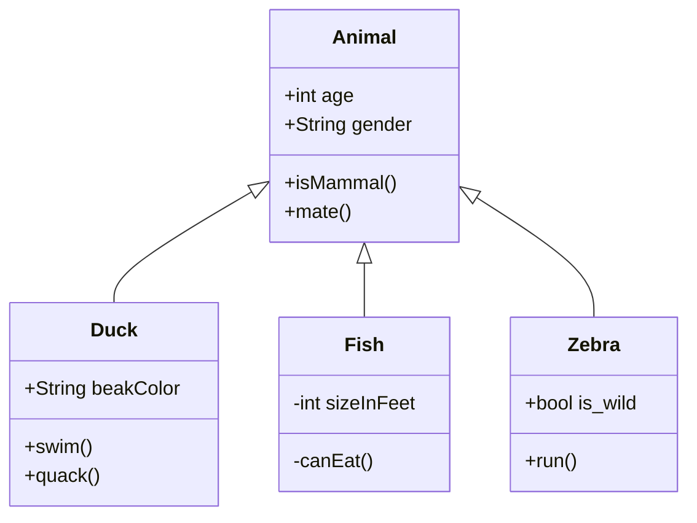

+++
title = "Code Plagiarism Detector Presentation"
description = "TODO"
outputs = ["Reveal"]
+++

<section data-noprocess>
    <h4>Alma Mater Studiorum $\cdot$ Università di Bologna</h4>
    <h6 style="font-size:0.8em;">Campus di Cesena</h6>
    

    
Dipartimento di informatica $-$ Scienza e Ingegneria

    
Corso di Laurea in Ingegneria e Scienze Informatiche

    <h2 style="margin:1em 0"><a href="https://github.com/tassiLuca/bachelor-thesis/releases/latest">Progettazione e sviluppo di uno strumento per la scansione di progetti software alla ricerca di potenziali segni di plagio</a></h2>
    
Elaborato in

    <h6>PROGRAMMAZIONE A OGGETTI</h6>
    

        

            
Relatore

            
Prof. Danilo Pianini

        

        

            
Presentata da:

            
Luca Tassinari

        

    

</section>

---

# Contesto e motivazioni

Questa tesi nasce dalla necessità di sviluppare uno strumento capace d'individuare potenziali *plagi* in progetti software.

Il plagiarismo nel software è pratica che, nel tempo, ha visto numerosi scontri legali (ad esempio, Oracle contro Google per Android), e per il quale sono pochi i progetti open source di facile utilizzo pratico.

L'elaborato, quindi, si addentra nelle tecniche di analisi e d'individuazione di possibili plagi, presentando il processo di progettazione e sviluppo dello strumento.

---

# Perché un sistema antiplagio **automatico**?

{}
- La *complessità* dei progetti software *aumenta*;
{}

{}
- La *quantità* di progetti software a disposizione cresce esponenzialmente;
{}

{}
- Farlo manualmente è tedioso, impiega molto tempo e risorse!
{}

{}
In generale, creare un software antiplagio è **_complesso_**. 

Sono due le principali sfide da affrontare durante la progettazione.
{}

---

## Prima sfida: creare un tool più "furbo" dello sviluppatore

Quando la copiatura è un atto deliberato, lo sviluppatore adotta un insieme di tecniche per cercare di _offuscarle_.

Le principali rifattorizzazioni adottate possono essere classificate in _lessicali_ e _strutturali_.

---


- _lessicali:_
  - possono essere eseguite, in linea di principio, da un text editor
  - non richiedono la conoscenza del linguaggio di programmazione
  - Alcuni esempi:
    {}
    - riformulazione di commenti, la loro aggiunta o rimozione;
    - riformattazione del testo, l'introduzione di spazi vuoti, di nuove linee o il cambio dell'ordine dei parametri nella definizione delle funzioni;
    -  cambiare il nome degli identificatori e delle funzioni o i tipi di dato: ad esempio da `int` a `Integer` o da `float` a `double`.
---


- _strutturali:_
  - fortemente dipendenti dal linguaggio di programmazione $\Rightarrow$ maggior sforzo in termini di comprensione della logica del codice;
  - Alcuni esempi:
    

    
    - aggiungere istruzioni ridondanti, come dichiarazioni, inizializzazioni, istruzioni di stampa;
    - sostituire i costrutti di loop con costrutti equivalenti: passare da `for` a `do/while`, o da un approccio iterativo a uno funzionale, ad esempio tramite l’uso degli Stream in Java;
    - sostituire istruzioni `if` nidificate con dichiarazioni equivalenti, ad esempio `switch-case` o `when` in Kotlin, e viceversa;
    - cambiare l’ordine d’istruzioni indipendenti;
    - cambiare l’ordine degli operandi: ad esempio `x < y` può essere cambiato in `y >= x`;
    - sostituire la chiamata a funzione con il corpo della stessa
    
    

---



{}
**Tassonomia dei livelli di plagio di Faidhi & Robinson (1987)**: mappa le possibili rifattorizzazioni in sette livelli o categorie, sulla base della loro difficoltà: il più semplice è il livello zero che corrisponde a una copia letterale; il più impegnativo è il sesto livello che corrisponde a un cambiamento logico e può essere considerato plagio solo se si verifica in concomitanza con altri livelli.

---

## Seconda sfida: le prestazioni

Un sistema antiplagio che non si limita a confrontare la similarità tra una coppia di progetti, bensì effettui un controllo _uno a molti_ o _molti a molti_, in cui si testano _tutte le possibili coppie_, sono le prestazioni.

- la misurazione della somiglianza tra una coppia di sorgenti, nella gran parte degli algoritmi noti in letteratura, ha una complessità almeno quadratica nel numero delle istanze delle sue rappresentazioni
- per ogni valutazione, il numero di confronti da effettuare è tipicamente elevato
  

  
  - detto $N$ il numero di progetti, volendo confrontare tutte le coppie di progetti tra loro, dovrebbero essere eseguite $N(N−1)$ comparazioni.
  

---

Nel corso degli anni, è stato necessario porsi il problema di sviluppare strumenti di rilevamento automatici di plagi che fossero _efficienti_ ed _efficaci_.

Tre popolari famiglie di tecniche:

{}
- **attribute-based**
{}

{}
- **structure-based**
{}

{}
- **tecniche ibride**
{}

---

---

