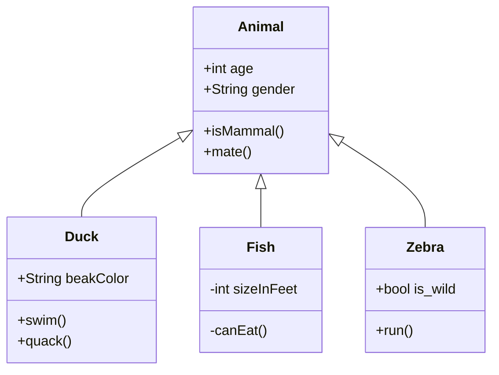

+++
title = "Code Plagiarism Detector Presentation"
description = "TODO"
outputs = ["Reveal"]
+++

<section data-noprocess>
    <h4>Alma Mater Studiorum $\cdot$ Università di Bologna</h4>
    <h6 style="font-size:0.8em;">Campus di Cesena</h6>
    

    
Dipartimento di informatica $-$ Scienza e Ingegneria

    
Corso di Laurea in Ingegneria e Scienze Informatiche

    <h2 style="margin:1em 0"><a href="https://github.com/tassiLuca/bachelor-thesis/releases/latest">Progettazione e sviluppo di uno strumento per la scansione di progetti software alla ricerca di potenziali segni di plagio</a></h2>
    
Elaborato in

    <h6>PROGRAMMAZIONE A OGGETTI</h6>
    

        

            
Relatore

            
Prof. Danilo Pianini

        

        

            
Presentata da:

            
Luca Tassinari

        

    

</section>

---

# Contesto e motivazioni

Questa tesi nasce dalla necessità di sviluppare uno strumento capace d'individuare potenziali plagi in progetti software.

Il plagiarismo nel software è pratica che, nel tempo, ha visto numerosi scontri legali (ad esempio, Oracle contro Google per Android), e per il quale sono pochi i progetti open source di facile utilizzo pratico.

L'elaborato, quindi, si addentra nelle tecniche di analisi e d'individuazione di possibili plagi, presentando il processo di progettazione e sviluppo dello strumento.

---

### Test

---

