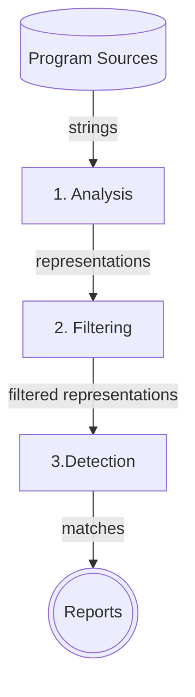
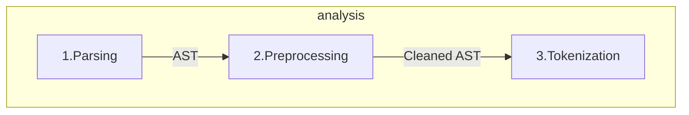
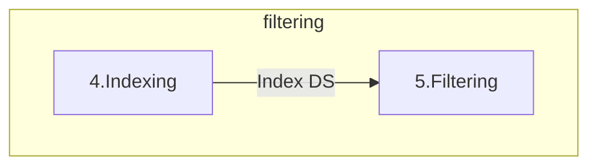
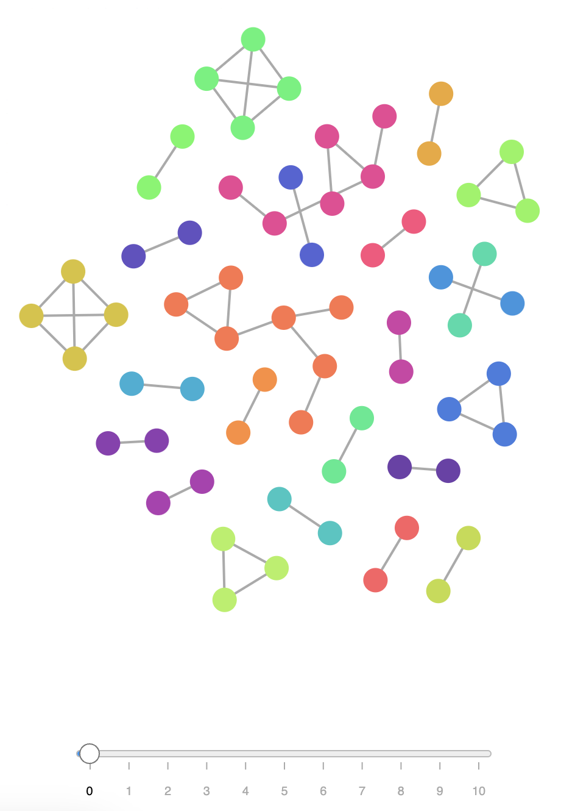

+++
title = "Code Plagiarism Detector Presentation"
description = "TODO"
outputs = ["Reveal"]
+++

# Code Plagiarism Detector
## [Tool per la scansione di progetti software alla ricerca di potenziali segni di plagio](https://github.com/DanySK/code-plagiarism-detector)

<hr/>

Tassinari Luca

---

## Plagiarismo e antiplagiarismo nel software

- problema annoso e in continua crescita
- ha visto, nel corso degli anni, numerosi scontri legali, i.e. Oracle vs. Google per Android 
- farlo manualmente è impraticabile $\Rightarrow$ è necessario un tool _automatico_

**MA**

- sono pochi i progetti _open source_ di facile utilizzo
- creare un software antiplagio è _complesso_!

---

## Requisiti di un tool antiplagio moderno

<div class="container">
<div class="col" style="width: 50%;">

- sia in grado di essere insensibile a rifattorizzazioni operate per offuscare la copiature

{}
- effettui il confronto su più progetti
  - ⚠️ la misura della similarità tra sorgenti è un'operazione onerosa in termini computazionali!
{}

</div>

<div class="col" style="width: 50%; font-size: 0.8em; vertical-align: center">



{}
_[Tassonomia dei livelli di plagio di Faidhi & Robinson (1987)](https://www.sciencedirect.com/science/article/pii/036013158790042X)_

</div>
</div>

---

### Sistemi antiplagio automatici e loro caratteristiche



---

<div class="container">
<div class="col" style="width: 50%; text-align: right">

### Stadi logici di un tool antiplagio

</div>
<div class="col" style="width: 50%; padding: 0 23%">



</div>
</div>

---

### Fase 1: Analisi



1. I file sono _parsati_ $\rightarrow$ è generato l'_Abstract Syntax Tree_
2. _Preprocessing_: l'AST viene "ripulito" da dettagli insignificanti a livello semantico (commenti, dichiarazioni di `import`, `package`, ...)
3. L'AST viene visitato e vengono "emessi" i _token_ corrispondenti ai costrutti del linguaggio da valorizzare
   - ⚠️ la scelta dei tipi di token è un fattore critico

---

<div class="container">
<div class="col" style="margin-left: -7%">

Prima dell'analisi

```java
package org.examples;

import java.util.Arrays;

/**
 * This is a sample class to demonstrate the tokenization process.
 */
public class Main {
    public static void main(String[] args) {
        if (args.length > 0) {
            System.out.println("Program arguments: " + Arrays.toString(args));
        } else {
            System.out.println("Hello world from Java!");
        }
    }
}
```

</div>
<div class="col">

{}

Dopo la _tokenizzazione_

```text
[class-interface-decl (line=8, column=1), 
method-decl (line=9, column=5), 
parameter (line=9, column=29), 
block-stmt (line=9, column=44), 
if-stmt (line=10, column=9), 
binary-expr (line=10, column=13), 
field-access-expr (line=10, column=13), 
name-expr (line=10, column=13), 
literal-expr (line=10, column=27), 
block-stmt (line=10, column=30), 
expression-stmt (line=11, column=13), 
method-call-expr (line=11, column=13), 
field-access-expr (line=11, column=13), 
name-expr (line=11, column=13), 
binary-expr (line=11, column=32), 
literal-expr (line=11, column=32), 
method-call-expr (line=11, column=56), 
name-expr (line=11, column=56), 
name-expr (line=11, column=72), 
block-stmt (line=12, column=16), 
expression-stmt (line=13, column=13),
method-call-expr (line=13, column=13), 
field-access-expr (line=13, column=13), 
name-expr (line=13, column=13), 
literal-expr (line=13, column=32)]
```

{}

</div>
</div>

---

### Fase 2: Filtraggio

<div style="padding: 0 20%">



</div>

- i token sono indicizzati in coppie chiave-valore
  - chiavi: tipi di token
  - valore: frequenza (numero di occorrenze all'interno del sorgente)
- **similarità coseno**

---

Similarità coseno

---

### Fase 3: Detection
- È applicato un algoritmo di _string matching_ ([RKR-GST, 1993](https://www.researchgate.net/profile/Michael_Wise/publication/262763983_String_Similarity_via_Greedy_String_Tiling_and_Running_Karp-Rabin_Matching/links/59f03226aca272a2500141f4/String-Similarity-via-Greedy-String-Tiling-and-Running-Karp-Rabin-Matching.pdf)), riadattato per funzionare su sequenze di token 
-  ⚠️ fase più onerosa computazionalmente $\Rightarrow$ **esecuzione parallela**
   -  RKR-GST ha complessità, nel caso pessimo, $O(n^2)$

---

# Metriche
## Come vengono stimate le similarità?

---

## Similarità tra coppie di sorgenti

Data una coppia di sorgenti $A$ e $B$:

<div style="margin: 5% 0;">

$$
\text{max_sim_s}(A, B) = \frac{\sum_{match \in tiles} length}{min(|A|,|B|)}
$$

</div>

⚠️ 

$|A|=30, |B|=150, \sum_{match \in tiles} length = 30$

$\Rightarrow \text{max_sim_s(A,B)}=1$

---

Data una coppia di sorgenti $A$ e $B$:

<div style="border: 2px dashed forestgreen; margin: 3% 0;">

$$
\text{avg_sim_s}(A, B) = \frac{2 \cdot \sum_{match \in tiles} length}{|A|+|B|}
$$

</div>

<div class="smaller">

✅ $|A|=30, |B|=150, \sum_{match \in tiles} length = 30 \Rightarrow \text{avg_sim_s(A,B)}=0.33$

$\hspace{1cm}$

{}

⚠️ 

$|A|=|B|=30, \sum_{match \in tiles} length = 25 \Rightarrow \text{avg_sim_s(A,B)}=0.83$
$|A|=|B|=1000, \sum_{match \in tiles} length = 400  \Rightarrow \text{avg_sim_s(A,B)}=0.4$

{}

</div>

---

## Similarità tra coppie di progetti

La similarità tra due progetti, $A$ e $B$, è data da:

$$
sim_p(A, B) = max \biggl( \frac{|\text{reported sources of A}|}{|\text{sources of A}|}, \frac{|\text{reported sources of B|}}{|\text{sources of B}|} \biggl)
$$

$$
\cdot P_{75}(\text{similarity of reported sources})
$$

dove $P_{75}$ è il 75° percentile (o 3° quartile) delle similarità dei sorgenti segnalati.

---

# Il tool sviluppato

- sviluppato _ex novo_ in _Kotlin_, _open source_
<div class="smaller">

disponibile al link [git@github.com:DanySK/code-plagiarism-detector/](https://github.com/DanySK/code-plagiarism-detector.git) 

</div>

{}
- permette di reperire i progetti da _repository_ _GitHub_ e _Bitbucket_
{}

{}
- genera un report testuale con la stima di similarità _repo-to-repo_ e con le parti di codice simili
{}

{}
- è configurabile:
  - lunghezza minima della sequenza di _token_ da riportare (`min-tokens`)
  - soglia di similarità tra sorgenti (`min-duplication` $\in [0, 1]$)
  - soglia di filtraggio dei sorgenti (`threshold-filter` $\in [0, 1]$)
  - esclusione di file ritenuti non rilevanti/comune utilizzo (e.g. `Pair.java`)
{}

---

## Esempio di output

```text
******************************************************************
Report from plagiarism detector tool generated at 2022-11-13T17...
******************************************************************

Submitted Project: 7d79ff     

+++++++++++++++++++++++++++++ SUMMARY ++++++++++++++++++++++++++++
Compared with 354 repositories.
------------------------------------------------------------------
|compared with                                        |similarity|
------------------------------------------------------------------
|ac8a48                                               |      0.81|
|929c18                                               |      0.10|
|2b58aa                                               |      0.08|
|                             ...                                |
------------------------------------------------------------------
++++++++++++++++++++++++++++++++++++++++++++++++++++++++++++++++++
```

---

```text
> Matches found with ac8a48
                              ...
>> With similarity: 0.8655737704918033
>>>>>>>>>>>>>>>>>>>>>>>>>>>>>>>>>>>>>>>>>>>>>>>>>>>>>>>>>>>>>>>>>>>>>>>>>>>>>>>>>>>>>>>>>>>>>>>>>>>>>>>>>>>>>>>>>>>>>>>>>>>>>
[7d79ff/src/main/java/*/ShotManagerImpl.java]
        this.zombieModel.getZombies().stream()
            .filter(z -> Collision.isColliding(s.getBoundingBox(), z.getBoundingBox()))
            .forEach(z -> {
                this.zombieModel.hitZombie(z, s.getDamage());
                delete.add(s);
            });
        if(!delete.contains(s) && this.walls.stream().anyMatch(w -> Collision.isColliding(w, s.getBoundingBox()))) {
            delete.add(s);
        }
    });
    this.ended.addAll(delete);
    delete.forEach(s -> this.shotsActive.remove(s));
}

...
>>>>>>>>>>>>>>>>>>>>>>>>>>>>>>>>>>>>>>>>>>>>>>>>>>>>>>>>>>>>>>>>>>>>>>>>>>>>>>>>>>>>>>>>>>>>>>>>>>>>>>>>>>>>>>>>>>>>>>>>>>>>>
[ac8a48/src/main/java/*/AttackManagerImpl.java]
            this.zombieModel.getZombies().stream()
                .filter(z -> CollisionsUtils.isColliding(z.getBBox(), a.getBBox()))
                .forEach(z -> {
                    this.zombieModel.hitZombie(z, a.getDamage());
                    toDelete.add(a);
                });
            if (!toDelete.contains(a) && this.obstacles.stream().anyMatch(e -> CollisionsUtils.isColliding(e, a.getBBox()))) {
                toDelete.add(a);
            }
        }
    });

    this.deleted.addAll(toDelete);
    toDelete.forEach(a -> this.attacksActive.remove(a));
}

...
>>>>>>>>>>>>>>>>>>>>>>>>>>>>>>>>>>>>>>>>>>>>>>>>>>>>>>>>>>>>>>>>>>>>>>>>>>>>>>>>>>>>>>>>>>>>>>>>>>>>>>>>>>>>>>>>>>>>>>>>>>>>>
```

---

# Validazione dei risultati

- _corpus set_: 354 progetti amatoriali sviluppati in Java disponibili su GitHub
  - nessuno dei quali "copia nota" (ad esempio, fork) 
- _submission set_: una selezione di 130 dei sopra-citati progetti
- confronto con prodotto cartesiano
- 🫢 i nomi dei software sono stati anonimizzati per rispetto della _privacy_

---

### Analisi di sensitività

<div class="smaller">

| _Progetto originale_ | _Progetto copiato_ | _Similarità_ | _Ispezione manuale_        |
|----------------------|--------------------|--------------|----------------------------|
| 9b7266               | 80fd2e             | 100\%        | corrispondenza totale      |
| f0caf3               | c1e451             | 90\%         | corrispondenza totale      |
| ac8a48               | 7d79ff             | 81\%         | corrispondenza elevata     |
| 7bc0ee               | 2308d9             | 70\%         | corrispondenza medio-alta  |
| a5c39e               | 2ed153             | 62\%         | corrispondenza medio-alta  |
| 005bc2               | f67c20             | 55\%         | corrispondenza parziale    |
| 501b0f               | c01302             | 49\%         | corrispondenza parziale    |
| 8f5d5a               | afcd72             | 48\%         | falso positivo             |

</div>

### Analisi di sensibilità
Stime di similarità fuorvianti in corrispondenza di `getter`/`setter`.

---

## Sviluppi futuri

- tarare metriche di similarità
  - _idea_: eliminare la prima metrica di similarità e stimare la similarità tra progetti in base al numero di token riportati sul totale, pesando la "grandezza" del file (in numero token o righe)
- per ridurre il tempo d'esecuzione introdurre tecniche di filtraggio più efficaci della semplice similarità coseno

---

## `compare50`

<div class="smaller">

[progetto GitHub](https://github.com/cs50/compare50) | [documentazione](https://cs50.readthedocs.io/projects/compare50/en/latest/index.html)

</div>

- Harvard, 2018
- implementa 5 tipi di confronto:
  - **strutturale** (default `ON`): tokenizzazione + [Winnowing](https://theory.stanford.edu/~aiken/publications/papers/sigmod03.pdf)
  - **testuale** (default `ON`): rimozione degli spazi + Winnowing
  - **letterale** (default `ON`): Winnowing
  - _senza commenti_ (default `OFF`): rimuove i commenti (ma tiene gli spazi) + Winnowing
  - 😯 _"misspellings"_ (default `OFF`): confronta i commenti per parole inglesi con errori di ortografia identici.

---

## `compare50` vs ns. tool

<div class="smaller" style="margin:0 -10%">

| _Progetto originale_ | _Progetto copiato_ | _Similarità_ | _`compare50` structure_ | _`compare50` text_ | _`compare50` exact_ | _`compare50` nocomments_ | _`compare50` misspellings_ | 
|:--------------------:|:------------------:|:------------:|:-----------------------:|:------------------:|:-------------------:|:------------------------:|:--------------------------:|
| 9b7266               | 80fd2e             | 100\%        | 89\%                    | 73\%               | 74\%                | 77\%                     | 90\%                       |  
| f0caf3               | c1e451             | 89\%         | 88\%                    | 20\%               | 12\%                | 29\%                     | 49\%                       |
| ac8a48               | 7d79ff             | 81\%         | 66\%                    | 14\%               | 15\%                | 16\%                     | 73\%                       |
| 7bc0ee               | 2308d9             | 69\%         | 72\%                    | 9\%                | 14\%                | 11\%                     | 41\%                       |
| a5c39e               | 2ed153             | 56\%         | 46\%                    | 7\%                | 12\%                | 9\%                      | 58\%                       |
| 005bc2               | f67c20             | 55\%         | 44\%                    | 4\%                | 10\%                | 6\%                      | 39\%                       |
|                      |                    |              | 😊                      | 😑                 | 😑                   | 😑                       | 😑                         |

- N.B.: il confronto _misspellings_ non è significativo: la `javadoc` è piena di errori grammaticali (`@param`, `@link`, ...)

</div>

---

<div class="container">
<div class="col" style="width:50%">

 _ASPETTI POSITIVI_

- riesce a confrontare un numero molto elevato di progetti in breve tempo (meno di 1 ora)
  - il nostro tool effettua 1-354 comparazioni in circa 15 minuti
{}
- nel report finale è riportato un grafo che mostra _cluster_ di progetti simili
{}


</div>
<div class="col" style="width:50%">

{}

{}

</div>

---

**ASPETTI NEGATIVI**
- i _report_ non sono ordinati per sorgente più simile
- non è configurabile nella soglia di _token_ da riportare
- sono considerati dichiarazioni irrilevanti che appesantiscono inutilmente i report
  -  `import`, `package` 

---

<section data-noprocess>


</section>

---

# 🙏👋
## Grazie per l'attenzione!
