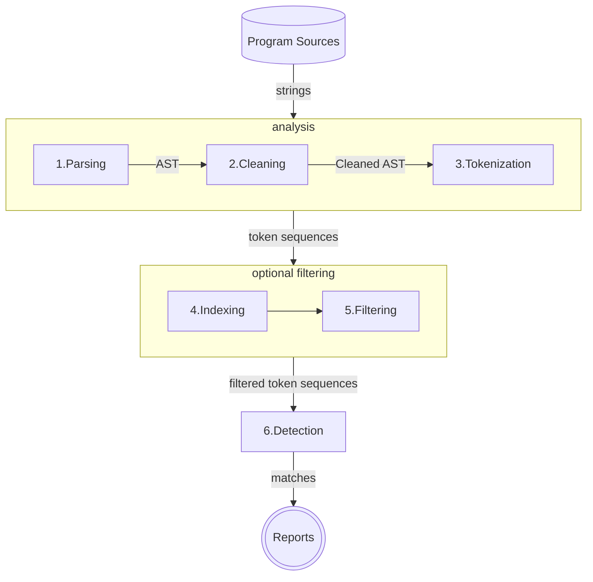

+++
title = "Code Plagiarism Detector Presentation"
description = "TODO"
outputs = ["Reveal"]
+++

<section data-noprocess>
    <h4>Alma Mater Studiorum $\cdot$ Università di Bologna</h4>
    <h6 style="font-size:0.8em;">Campus di Cesena</h6>
    <hr/>
    <p style="font-size:0.8em;">Dipartimento di informatica $-$ Scienza e Ingegneria</p>
    <p style="font-size:0.8em;">Corso di Laurea in Ingegneria e Scienze Informatiche</p>
    <h2 style="margin:1em 0"><a href="https://github.com/tassiLuca/bachelor-thesis/releases/latest">Progettazione e sviluppo di uno strumento per la scansione di progetti software alla ricerca di potenziali segni di plagio</a></h2>
    <p style="font-size:0.8em; margin-bottom:0">Elaborato in</p>
    <h6>PROGRAMMAZIONE A OGGETTI</h6>
    <div style="margin-top:1em;">
        <div style="width:50%; border-box:none; float: left">
            <p style="font-size:0.7em">Relatore</p>
            <p style="font-size:0.8em">Prof. Danilo Pianini</p>
        </div>
        <div style="width:50%; border-box:none; float: right">
            <p style="font-size:0.7em;">Presentata da:</p>
            <p style="font-size:0.8em;">Luca Tassinari</p>
        </div>
    </div>
</section>

---

# Contesto e motivazioni

Questa tesi nasce dalla necessità di sviluppare uno strumento capace d'individuare potenziali *plagi* in progetti software.

Il plagiarismo nel software è pratica che, nel tempo, ha visto numerosi scontri legali (ad esempio, Oracle contro Google per Android), e per il quale sono pochi i progetti open source di facile utilizzo pratico.

L'elaborato, quindi, si addentra nelle tecniche di analisi e d'individuazione di possibili plagi, presentando il processo di progettazione e sviluppo dello strumento.

---

# Perché un sistema antiplagio **automatico**?

{}
- La *complessità* dei progetti software è in *aumento*;
{}

{}
- La *quantità* di progetti software a disposizione cresce esponenzialmente;
{}

{}
- Farlo manualmente è tedioso, impiega molto tempo e risorse!
{}

{}
Creare un software antiplagio è tuttavia **_complesso_**. 

Sono due le principali sfide da affrontare durante la progettazione.
{}

---

## Prima sfida: creare un tool "più furbo" dello sviluppatore

Quando la copiatura è un atto deliberato, lo sviluppatore adotta un insieme di tecniche per cercare di _offuscarle_.

Un qualunque sistema di rilevamento di plagi, perché possa essere considerato _robusto_ ed _efficace_, dovrà essere "poco" influenzabile da queste possibili rifattorizzazioni.

---



{}
**Tassonomia dei livelli di plagio di Faidhi & Robinson (1987)**: mappa le possibili rifattorizzazioni in sette livelli o categorie, sulla base della loro difficoltà: il più semplice è il livello zero che corrisponde a una copia letterale; il più impegnativo è il sesto livello che corrisponde a un cambiamento logico e può essere considerato plagio solo se si verifica in concomitanza con altri livelli.

---

## Seconda sfida: le prestazioni

Un sistema antiplagio che non si limita a confrontare la similarità tra una coppia di progetti, bensì effettui un controllo _uno a molti_ o _molti a molti_, in cui si testano _tutte le possibili coppie_, sono le prestazioni.

- la misurazione della somiglianza tra una coppia di sorgenti, nella gran parte degli algoritmi noti in letteratura, ha una complessità almeno quadratica nel numero delle istanze delle sue rappresentazioni
- per ogni valutazione, il numero di confronti da effettuare è tipicamente elevato
  <div class="smaller">
  
  - detto $N$ il numero di progetti, volendo confrontare tutte le coppie di progetti tra loro, dovrebbero essere eseguite $\frac{N(N-1)}{2}$ comparazioni.
  </div>

---

Nel corso degli anni, è stato necessario porsi il problema di sviluppare strumenti di rilevamento automatici di plagi che fossero _efficienti_ ed _efficaci_.

Tre popolari famiglie di tecniche:

{}
- **attribute-based**
{}

{}
- **structure-based**
{}

{}
- **tecniche ibride**
{}

---

## Attribute based
- sono quelle che storicamente sono state introdotte per prime
  - il primo sistema automatico di plagi (1976) utilizzava le metriche di _Healstead_ per determinare la similarità
- Utilizzano metriche basate su attributi intrinseci del codice sorgente
  - numero di istruzioni di _loop_, espressioni condizionali, ...

{}
- ✅ semplicità
{}

{}
- ❌ non sono strettamente correlate alla semantica del programma $\rightarrow$ la misurazione della somiglianza può risultare essere imprecisa. In generale l’efficacia di queste tecniche è _considerevolmente limitata_ in termini di accuratezza
{}

---

## Structure based
- si basano, come suggerisce il nome, sulla struttura dei codici sorgenti per determinare il grado di similarità tra gli stessi.
- Nella maggioranza dei casi, i sistemi che implementano questo tipo di tecnica lavorano in due fasi consecutive: prima il codice sorgente viene _analizzato_ e viene generata una _rappresentazione intermedia_, poi si effettua il _confronto_ dei sorgenti sulle rappresentazioni intermedie.
  <div class="smaller">
  
  - Questa è la tecnica implementata nel tool sviluppato!
  </div>

{}
- ✅ efficacia
{}

{}
- ❌ onerosi computazionalmente
{}

---

## Tecniche ibride
- Visti gli aspetti positivi e negativi delle due tecniche precedenti alcuni lavori di ricerca hanno cercato di combinare entrambi gli approcci creando tecniche di analisi ibride, presi a prestito anche da altri domini (vedi analisi testuale).
  - Tra queste spiccano la _Latent Semantic Analysis_ e tecniche di _clustering_
  - Altri metodi in via di sviluppo che impiegano algoritmi di _machine learning_ (_Random Forest_ e _Gradient Boosting_ applicati agli alberi di regressione)

---

<div class="container">
<div class="col" style="width: 35%; font-size: 0.8em; vertical-align: center">

# Il tool sviluppato
- usa una tecnica _structure_ based
1. Fase di _analisi_: i sorgenti sono trasformati in sequenze di _token_
2. Fase di _filtraggio_: le rappresentazioni sono filtrare in accordo ad una metrica
3. Fase di _confronto_ delle rappresentazioni

</div>
<div class="col" style="width: 65%;">



</div>
</div>

---

## Fase di analisi

<div class="container">
<div class="col" style="width: 35%; font-size: 0.8em; vertical-align: center">

1. I sorgenti sono **parsati** $\rightarrow$ _Abstract Syntax Tree_
2. Fase intermedia di _preprocessing_ in cui dall’albero vengono rimosse le dichiarazioni irrilevanti: commenti, dichiarazione di `import` e `package`, funzioni generate automaticamente dall'IDE, come `hashCode()` e `equals()`.
3. L'albero viene visitato e vengono emessi i _token_

</div>
<div class="col" style="width: 80%;">



</div>
</div>

---

<div class="container">
<div class="col" style="margin-left: -7%">

### Prima dell'analisi

```java
package org.examples;

import java.util.Arrays;

/**
 * This is a sample class to demonstrate the tokenization process.
 */
public class Main {
    public static void main(String[] args) {
        if (args.length > 0) {
            System.out.println("Program arguments: " + Arrays.toString(args));
        } else {
            System.out.println("Hello world from Java!");
        }
    }
}
```

</div>
<div class="col">

{}

### Dopo la _tokenizzazione_

```text
[class-interface-decl (line=8, column=1), 
method-decl (line=9, column=5), 
parameter (line=9, column=29), 
block-stmt (line=9, column=44), 
if-stmt (line=10, column=9), 
binary-expr (line=10, column=13), 
field-access-expr (line=10, column=13), 
name-expr (line=10, column=13), 
literal-expr (line=10, column=27), 
block-stmt (line=10, column=30), 
expression-stmt (line=11, column=13), 
method-call-expr (line=11, column=13), 
field-access-expr (line=11, column=13), 
name-expr (line=11, column=13), 
binary-expr (line=11, column=32), 
literal-expr (line=11, column=32), 
method-call-expr (line=11, column=56), 
name-expr (line=11, column=56), 
name-expr (line=11, column=72), 
block-stmt (line=12, column=16), 
expression-stmt (line=13, column=13),
method-call-expr (line=13, column=13), 
field-access-expr (line=13, column=13), 
name-expr (line=13, column=13), 
literal-expr (line=13, column=32)]
```

{}

</div>
</div>


---

## Fase di filtraggio

A seguito dell’analisi del codice sorgente e della generazione della sequenza di token i sorgenti del corpus possono essere filtrati, al fine di limitare il numero di progetti da dover confrontare e, quindi, ridurre il tempo d'esecuzione.

1. Fase d’_indicizzazione_ in cui vengono aggregati i dati sotto forma di una struttura dati per mezzo della quale è possibile estrarre informazioni statistiche significative per la stima della similarità
2. ...

---

## Fase di confronto delle rappresentazione

- vengono impiegati algoritmi di _string matching_, riadattati per operare su sequenze di _token_
  - _Running Karp-Rabin Greedy String Tiling_, introdotto da M. Wise nel 1993, a seguito della necessità di sviluppare proprio un sistema automatico antiplagio, anche se negli anni successivi gli stessi algoritmi sono stati impiegati in altri campi, tra cui il confronto di sequenze di proteine/DNA.
    - Complessità: nel caso **pessimo** $O(n^2)$, nel caso **medio** ...

---

## Stima di similarità tra sorgenti

...

---

## Stima di similarità tra progetti

...

---

# Progettazione

- I progetti, coerenti per linguaggio di programmazione, sono recuperati a partire da _repository_ su _GitHub_ e _Bitbucket_.
- Si assume che i progetti siano **tempo-invarianti** $\rightarrow$ vengono _cachati_ in modo tale da poter essere riutilizzate in analisi successive.
- L'architettura è stata concepita per essere **estendibile** e **configurabile** nella tecnica e nei parametri da poter utilizzare.
- ...

---

# \<SCHEMA ARCHITETTURALE\>

---

# RISULTATI 

---

# SVILUPPI FUTURI

---

# ESEMPIO DI REPORT GENERATO DALLO STRUMENTO

---