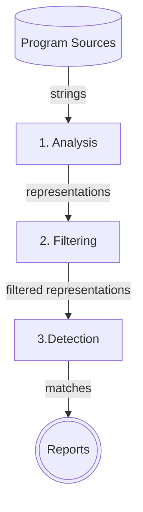
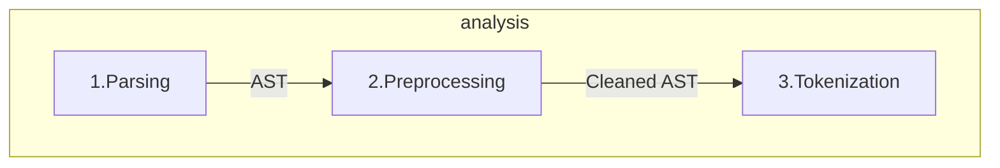
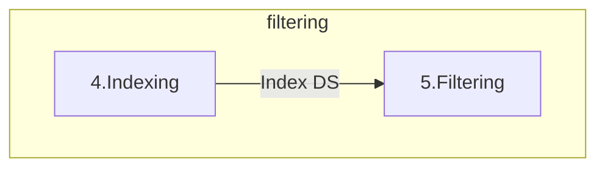

+++
title = "Code Plagiarism Detector Presentation"
description = "TODO"
outputs = ["Reveal"]
+++

<section data-noprocess>
    <h4 style="color:black">Alma Mater Studiorum $\cdot$ Università di Bologna</h4>
    <h6 style="font-size:0.8em; color:black;">Campus di Cesena</h6>
    <hr/>
    <p style="font-size:0.8em;">Dipartimento di informatica $-$ Scienza e Ingegneria</p>
    <p style="font-size:0.8em;">Corso di Laurea in Ingegneria e Scienze Informatiche</p>
    <h2 style="margin:1em 0"><a href="https://github.com/tassiLuca/bachelor-thesis/releases/latest" style="color:#3457D5">Progettazione e sviluppo di uno strumento per la scansione di progetti software alla ricerca di potenziali segni di plagio</a></h2>
    <p style="font-size:0.8em; margin-bottom:0">Elaborato in</p>
    <h6 style="color:black">PROGRAMMAZIONE A OGGETTI</h6>
    <div style="margin-top:1em;">
        <div style="width:50%; border-box:none; float: left">
            <p style="font-size:0.7em">Relatore</p>
            <p style="font-size:0.8em">Prof. Danilo Pianini</p>
        </div>
        <div style="width:50%; border-box:none; float: right">
            <p style="font-size:0.7em;">Presentata da:</p>
            <p style="font-size:0.8em;">Luca Tassinari</p>
        </div>
    </div>
</section>

---

## Plagiarismo e antiplagiarismo nel software

- problema annoso e in continua crescita
- ha visto, nel corso degli anni, numerosi scontri legali, i.e. Oracle vs. Google per Android 
- farlo manualmente è impraticabile $\Rightarrow$ è necessario un tool _automatico_
- sono pochi i progetti _open source_ di facile utilizzo

**MA**

Creare un software antiplagio è _complesso_!

---

## Requisiti di un tool antiplagio moderno

<div class="container">
<div class="col" style="width: 50%;">

- sia in grado di essere insensibile a rifattorizzazioni operate per offuscare la copiature

{}
- effettui il confronto su più progetti
  - ⚠️ la misura della similarità tra sorgenti è un'operazione onerosa in termini computazionali!
{}

</div>

<div class="col" style="width: 50%; font-size: 0.8em; vertical-align: center">



{}
_Tassonomia dei livelli di plagio di Faidhi & Robinson (1987)_

</div>
</div>

---

### Sistemi antiplagio automatici e loro caratteristiche



---

<div class="container">
<div class="col" style="width: 50%; text-align: right">

### Stadi logici di un tool antiplagio

</div>
<div class="col" style="width: 50%; padding: 0 23%">



</div>
</div>

---

### Fase 1: Analisi



1. I file sono _parsati_ $\rightarrow$ è generato l'_Abstract Syntax Tree_
2. _Preprocessing_: l'AST viene "ripulito" da dettagli insignificanti a livello semantico (commenti, dichiarazioni di `import`, `package`, ...)
3. L'AST viene visitato e vengono "emessi" i _token_ corrispondenti ai costrutti del linguaggio da valorizzare
   - ⚠️ la scelta dei tipi di token è un fattore critico

---

<div class="container">
<div class="col" style="margin-left: -7%">

Prima dell'analisi

```java
package org.examples;

import java.util.Arrays;

/**
 * This is a sample class to demonstrate the tokenization process.
 */
public class Main {
    public static void main(String[] args) {
        if (args.length > 0) {
            System.out.println("Program arguments: " + Arrays.toString(args));
        } else {
            System.out.println("Hello world from Java!");
        }
    }
}
```

</div>
<div class="col">

{}

Dopo la _tokenizzazione_

```text
[class-interface-decl (line=8, column=1), 
method-decl (line=9, column=5), 
parameter (line=9, column=29), 
block-stmt (line=9, column=44), 
if-stmt (line=10, column=9), 
binary-expr (line=10, column=13), 
field-access-expr (line=10, column=13), 
name-expr (line=10, column=13), 
literal-expr (line=10, column=27), 
block-stmt (line=10, column=30), 
expression-stmt (line=11, column=13), 
method-call-expr (line=11, column=13), 
field-access-expr (line=11, column=13), 
name-expr (line=11, column=13), 
binary-expr (line=11, column=32), 
literal-expr (line=11, column=32), 
method-call-expr (line=11, column=56), 
name-expr (line=11, column=56), 
name-expr (line=11, column=72), 
block-stmt (line=12, column=16), 
expression-stmt (line=13, column=13),
method-call-expr (line=13, column=13), 
field-access-expr (line=13, column=13), 
name-expr (line=13, column=13), 
literal-expr (line=13, column=32)]
```

{}

</div>
</div>

---

### Fase 2: Filtraggio

<div style="padding: 0 20%">



</div>

1. Le rappresentazioni (sequenze di _token_) sono aggregate sotto forma di strutture dati dalla quali è possibile estrarre informazioni statistiche sulla base delle quali viene stimata la similarità

{}

### Fase 3: Detection
È applicato un algoritmo di _string matching_, riadattato per funzionare su sequenze di token $\Rightarrow$ ⚠️ fase più onerosa in termini di tempo di calcolo

{}

---

# Il tool sviluppato
- permette di reperire i progetti da _repository_ _GitHub_ e _Bitbcuket_

{}
- genera un report testuale con la stima di similarità _repo-to-repo_ e con le parti di codice simili
{}

{}
- è estendibili nel tipo di tecnica impiegata
{}

{}
- è configurabile:
  - lunghezza minima della sequenza di _token_ che dovrebbe essere riportata
  - soglia di similarità tra sorgenti ($ 0. \div 1.$)
  - soglia di filtraggio dei sorgenti ($ 0. \div 1.$)
  - esclusione di alcuni file ritenuti non rilevanti e di comune utilizzo (i.e. `Pair.java`)
{}

---

## Esempio di output

```text
******************************************************************
Report from plagiarism detector tool generated at 2022-11-13T17...
******************************************************************

Submitted Project: 7d79ff     

+++++++++++++++++++++++++++++ SUMMARY ++++++++++++++++++++++++++++
Compared with 354 repositories.
------------------------------------------------------------------
|compared with                                        |similarity|
------------------------------------------------------------------
|ac8a48                                               |      0.81|
|929c18                                               |      0.10|
|2b58aa                                               |      0.08|
|                             ...                                |
------------------------------------------------------------------
++++++++++++++++++++++++++++++++++++++++++++++++++++++++++++++++++
```

---

```text
> Matches found with ac8a48
                              ...
>> With similarity: 0.8655737704918033
>>>>>>>>>>>>>>>>>>>>>>>>>>>>>>>>>>>>>>>>>>>>>>>>>>>>>>>>>>>>>>>>>>>>>>>>>>>>>>>>>>>>>>>>>>>>>>>>>>>>>>>>>>>>>>>>>>>>>>>>>>>>>
[7d79ff/src/main/java/*/ShotManagerImpl.java]
        this.zombieModel.getZombies().stream()
            .filter(z -> Collision.isColliding(s.getBoundingBox(), z.getBoundingBox()))
            .forEach(z -> {
                this.zombieModel.hitZombie(z, s.getDamage());
                delete.add(s);
            });
        if(!delete.contains(s) && this.walls.stream().anyMatch(w -> Collision.isColliding(w, s.getBoundingBox()))) {
            delete.add(s);
        }
    });
    this.ended.addAll(delete);
    delete.forEach(s -> this.shotsActive.remove(s));
}

...
>>>>>>>>>>>>>>>>>>>>>>>>>>>>>>>>>>>>>>>>>>>>>>>>>>>>>>>>>>>>>>>>>>>>>>>>>>>>>>>>>>>>>>>>>>>>>>>>>>>>>>>>>>>>>>>>>>>>>>>>>>>>>
[ac8a48/src/main/java/*/AttackManagerImpl.java]
            this.zombieModel.getZombies().stream()
                .filter(z -> CollisionsUtils.isColliding(z.getBBox(), a.getBBox()))
                .forEach(z -> {
                    this.zombieModel.hitZombie(z, a.getDamage());
                    toDelete.add(a);
                });
            if (!toDelete.contains(a) && this.obstacles.stream().anyMatch(e -> CollisionsUtils.isColliding(e, a.getBBox()))) {
                toDelete.add(a);
            }
        }
    });

    this.deleted.addAll(toDelete);
    toDelete.forEach(a -> this.attacksActive.remove(a));
}

...
>>>>>>>>>>>>>>>>>>>>>>>>>>>>>>>>>>>>>>>>>>>>>>>>>>>>>>>>>>>>>>>>>>>>>>>>>>>>>>>>>>>>>>>>>>>>>>>>>>>>>>>>>>>>>>>>>>>>>>>>>>>>>
```

---

# Validazione dei risultati

- _submission set_: 130 progetti universitari sviluppati in Java nel triennio 2019-21
- _corpus set_: +354 progetti sottomessi nello stesso corso (2015-) 
  - confronto a "prodotto cartesiano"

---

## Analisi di sensitività

<div class="smaller">

| _Progetto originale_ | _Progetto copiato_ | _Similarità_ | _Ispezione manuale_        |
|----------------------|--------------------|--------------|----------------------------|
| 9b7266               | 80fd2e             | 100\%        | corrispondenza totale      |
| f0caf3               | c1e451             | 90\%         | corrispondenza totale      |
| ac8a48               | 7d79ff             | 81\%         | corrispondenza elevata     |
| 7bc0ee               | 2308d9             | 70\%         | corrispondenza medio-alta  |
| a5c39e               | 2ed153             | 62\%         | corrispondenza medio-alta  |
| 005bc2               | f67c20             | 55\%         | corrispondenza parziale    |
| 501b0f               | c01302             | 49\%         | corrispondenza parziale    |
| 8f5d5a               | afcd72             | 48\%         | falso positivo             |

</div>

## Analisi di sensibilità
Stime di similarità fuorvianti in corrispondenza di `getter`/`setter` e in corrispondenza di numerose costanti $\Rightarrow$ taratura delle metriche di stima delle similarità e del set di _token_

---

# 🙏
### Grazie per l'attenzione!
